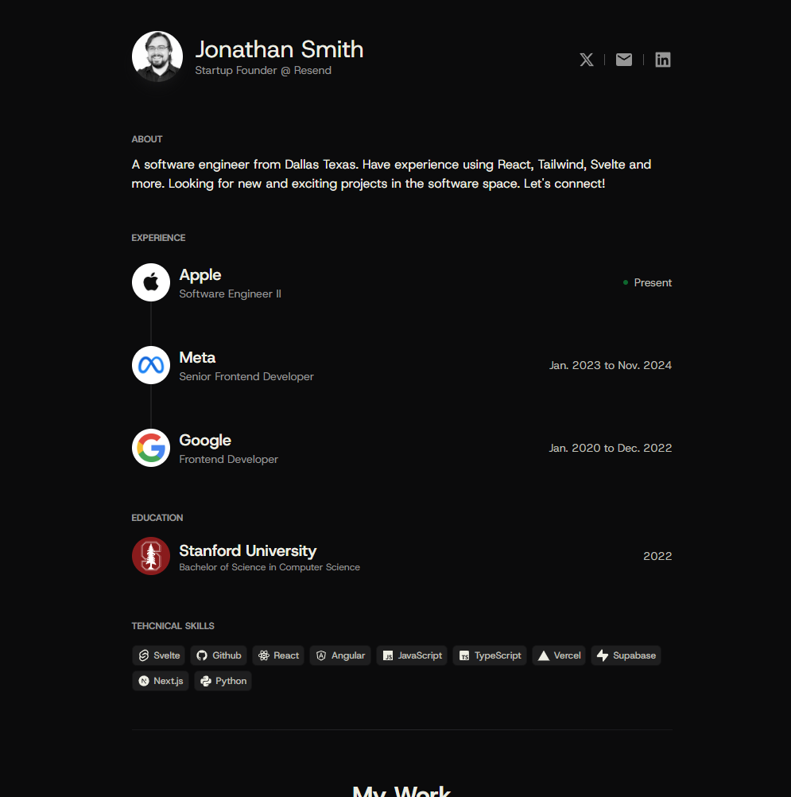

# Svelte 5 Portfolio Template - A Coastal UI Project

[Click Here for Live Demo](https://svelte-5-portfolio.vercel.app/)



A modern, sleek portfolio template built with Svelte 5 and Tailwind CSS. Perfect for showcasing your work, experience, and skills in a professional manner.

Join our growing community on [Discord](https://discord.gg/fB5uJYYD8E) for support and feature discussions! Also visit [Coastal UI](https://coastalui.com) to learn more about our components and projects.

## Hall of Fame Portfolios

- https://emadev.co/
- https://www.thomaslap.dev/

## Features
The template includes a centralized `portfolioContent` object that manages all your personal information:
- Introduction section with social links
- Work experience timeline
- Education history
- Technical skills showcase
- Personal projects gallery
- Interactive component showcase

## Tech Stack
- **Svelte 5** - Leveraging the latest features including runes
- **Tailwind CSS** - Utility-first styling for modern designs
- **TypeScript** - Type-safe development
- **Lucide Icons** - Beautiful, consistent icons

## Getting Started
```bash
# Clone this template repository
git clone https://github.com/thomaslappenbusch/svelte-5-portfolio.git

# Navigate to project directory
cd svelte-5-portfolio

# Install dependencies
npm install

# Start development server
npm run dev
